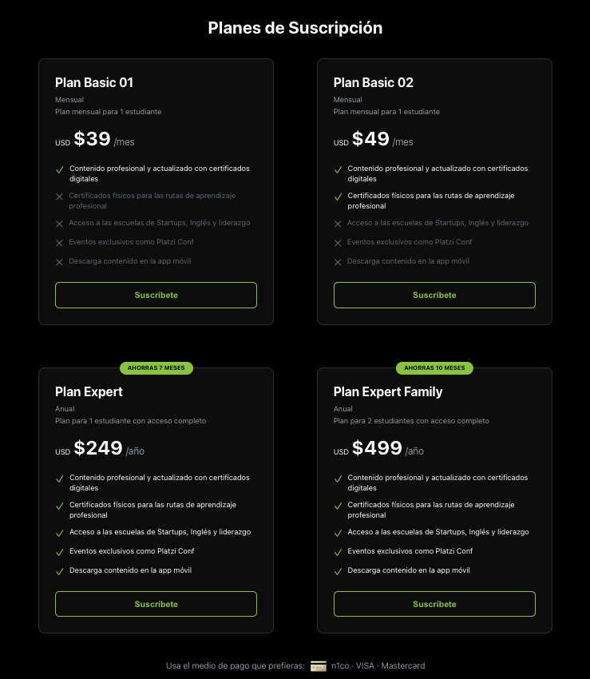
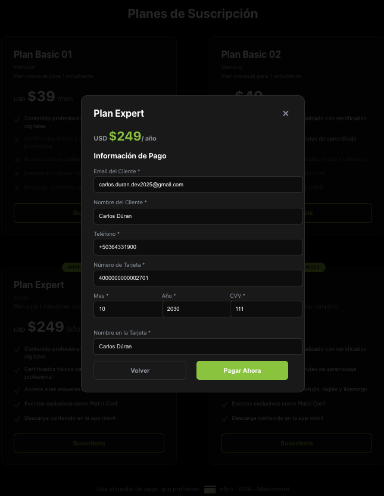
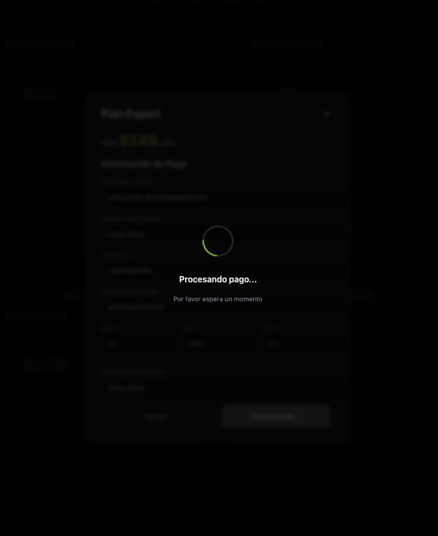
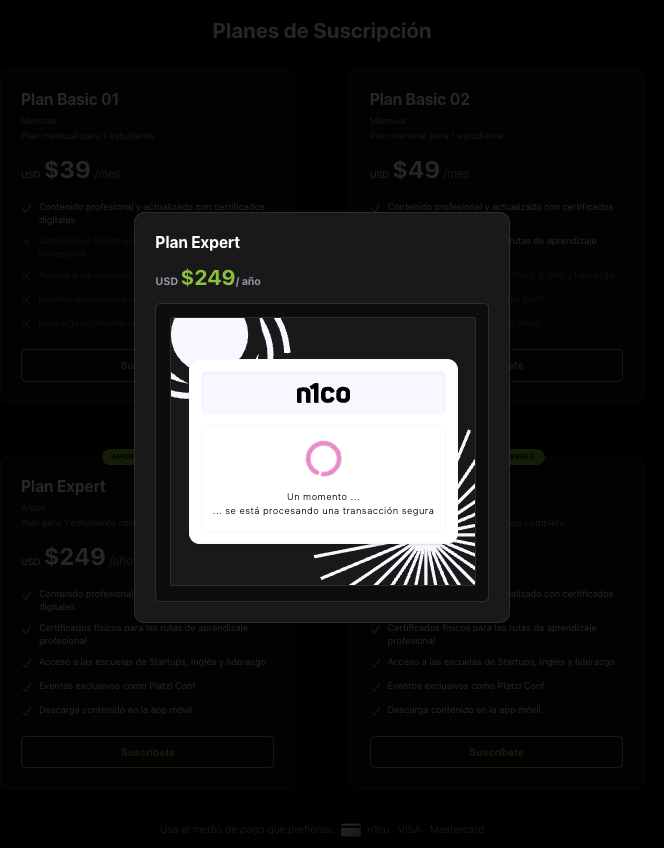
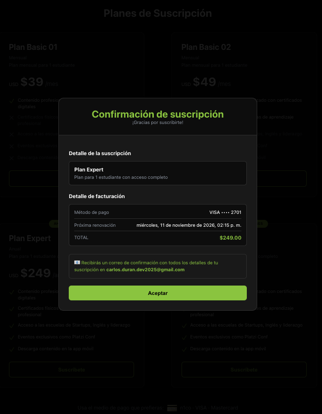

# 💳 Demo ePay - Sistema de Suscripciones


Sistema de suscripciones con integración a la API de pagos N1co. Incluye autenticación, gestión dinámica de planes y flujo completo de pagos con soporte 3D Secure. Este proyecto es una aplicación en ReactJS que muestra una página de planes de suscripción, integrada con la API de pagos N1co (ePay).


## Características

### 🎨 Interfaz Moderna

- **Planes Dinámicos:** Configurables desde variables de entorno
- **Autenticación Automática:** Generación y renovación automática de tokens al cargar la aplicación.

- **Manejo de Errores 401:** Renovación automática del token cuando detecta errores de autenticación.


### 💰 Flujo de Pagos Completo

- **Método N1co:** Redirección a página de pago en nueva pestaña  - Soporte para autenticación 3D Secure

- **Pago con Tarjeta:** Formulario integrado con validación
- **Gestión de Suscripciones:** Creación de suscripciones con manejo de métodos de pago y autenticación 3DS.

- **3D Secure:** Soporte completo con iframe para autenticación
- **Variables de Entorno:** Configuración centralizada de credenciales, planes y código de sucursal.

- **ReactJS 19:** Framework para la interfaz de usuario.

- **Node.js + Express:** Servidor proxy para autenticación segura.

---

## 📸 Capturas de Pantalla

- ### Vista de Planes


- ### Métodos de Pago


- ### Pagar con Tarjeta


- ### Procesando Pago


- ### Requiere Autorización 3DS


- ### Mensaje de Confirmación


---

## 🛠 Instalación

### Prerrequisitos

- **Node.js:** v14 o superior

- **npm:** v6 o superior

- **Cuenta N1co:** Client ID y Client Secret

### Pasos

1. **Clonar el repositorio:** El proyecto utiliza un sistema de variables de entorno separadas para **backend** (credenciales seguras) y **frontend** (datos públicos).

```bash
git clone 
```

2.  **Configura el archivo `.env`:** Copia el archivo de ejemplo:


```bash
 cp .env.example .env
```

3.  **Instalar dependencias:**   

```bash

npm install

```


### Verificación del Sistema


### Iniciar frontend y backend simultáneamente   
```bash
npm run dev  
 ```


### Solo frontend (puerto 3000)
```bash
npm start 
 ```

###  Solo backend (puerto 3001)   
```bash
npm run server   
```
**Verifica el Backend:** Desarrollo Local   
```bash
   curl http://localhost:3001/health
```  

**Verifica el Frontend:** Abre `http://localhost:3000` en tu navegador


## 📁 Estructura del Proyecto


```

DemoEpay/  

├── public/  

│   ├── index.html           

│   └── robots.txt         

├── src/

│   ├── components/   

│   │   ├── IFrameWithMessageListener.js  # Manejo de 3DS

│   │   ├── PaymentModal.js               # Modal de pagos

│   │   └── PricingSection.js             # Sección de planes

│   ├── utils/   

│   │   ├── apiWrapper.js    # Wrapper API con tokens automáticos 

│   │   └── authManager.js   # Singleton para gestión de tokens   
│   ├── App.js               # Componente principal  

│   ├── index.css            # Estilos globales

│   └── index.js             # Punto de entrada

├── .env                     # Variables de entorno (NO SUBIR A GIT)

├── .env.example             # Template de variables   

├── .gitignore              # Archivos ignorados por Git 

├── package.json            # Dependencias y scripts

├── server.js               # Servidor proxy para el manejo de tokens

├── test-security.sh        # Tests automáticos de seguridad

└── README.md               

```


### Endpoints Utilizados

| Endpoint | Método | Descripción |
|----------|--------|-------------|
| `/Token` | POST | Autenticación |
| `/Plans/{id}` | GET | Obtener plan por ID |
| `/PaymentMethods` | POST | Crear método de pago |
| `/Subscriptions` | POST | Crear suscripción |

---

## 🔐 Variables de Entorno


| Variable | Tipo | Descripción | Ejemplo |
|----------|------|-------------|---------|
| `N1CO_CLIENT_ID` | Backend | ID de cliente N1co | `c8573b9a-88ea-45b6...` |
| `N1CO_CLIENT_SECRET` | Backend | Secret de cliente N1co | `kt48Q~e8FS1FNgve...` |
| `PROXY_API_KEY` | Backend | Key para autenticar frontend | `2I9Phh1C9k...` |
| `FRONTEND_URL` | Backend | URL del frontend en prod | `https://app.com` |
| `REACT_APP_API_BASE_URL` | Frontend | URL base de N1co API | `https://api.h4b.dev/api/v3` |
| `REACT_APP_API_PROXY_URL` | Frontend | URL del servidor proxy | `http://localhost:3001` |
| `REACT_APP_PROXY_API_KEY` | Frontend | Key para el proxy (igual a PROXY_API_KEY) | `2I9Phh1C9k...` |
| `REACT_APP_PLAN_IDS` | Frontend | IDs de planes (separados por coma) | `1742,1728,1729` |
| `REACT_APP_LOCATION_CODE` | Frontend | Código de sucursal N1co | `N1C0CD001` |

---

## 🛡️ Seguridad


#### 1. Diferenciación de Entornos
```javascript
const IS_PRODUCTION = process.env.NODE_ENV === 'production';
```

#### 2. CORS Específico
```javascript
// Desarrollo: localhost permitido
allowedOrigins = ['http://localhost:3000'];

// Producción: solo tu dominio
allowedOrigins = [process.env.FRONTEND_URL];
```

#### 3. API Key
```javascript
// El frontend debe enviar x-api-key
headers: { 'x-api-key': process.env.REACT_APP_PROXY_API_KEY }
```

#### 4. Rate Limiting
- **Desarrollo:** 30 req/min
- **Producción:** 20 req/min

### Validaciones al Inicio

El servidor valida la configuración al arrancar:
```
✅ Cliente ID configurado
✅ Cliente Secret configurado
✅ API Key no es la default
✅ FRONTEND_URL configurado (solo en producción)
```

### Pruebas de Seguridad

```bash
./test-security.sh
```

Ejecuta 5 tests:
1. ✅ Acceso con API Key válida
2. ❌ Rechazo sin API Key
3. ❌ Rechazo con API Key inválida
4. ❌ Rechazo con API Key default
5. ⏱️ Rate limiting activado

---

## 📜 Scripts Disponibles

```bash
# Desarrollo (frontend + backend simultáneamente)
npm run dev

# Solo frontend (puerto 3000)
npm start

# Solo backend (puerto 3001)
npm run server

# Build de producción
npm run build

node server.js

# Tests de seguridad
./test-security.sh

# Generar API Key
node -e "console.log(require('crypto').randomBytes(32).toString('base64'))"
```

---

## 🚀 Despliegue

### Frontend

1. **Build:**
```bash
npm run build
```

2. **Variables de entorno:**
```
REACT_APP_API_BASE_URL=https://api.h4b.dev/api/v3
REACT_APP_API_PROXY_URL=https://tu-backend.herokuapp.com
REACT_APP_PROXY_API_KEY=tu_api_key_segura
REACT_APP_PLAN_IDS=1742,1728,1729
REACT_APP_LOCATION_CODE=N1C0CD001
```

### Backend

1. **Variables de entorno:**
```
NODE_ENV=production
N1CO_CLIENT_ID=tu_client_id
N1CO_CLIENT_SECRET=tu_client_secret
PROXY_API_KEY=tu_api_key_segura
FRONTEND_URL=https://tu-app.vercel.app
```

2. **Comando de inicio:**
```bash
node server.js
```

3. **Puerto dinámico:**
```javascript
const PORT = process.env.PORT || 3001;
```

## 📚 Documentación Adicional

- [test-security.sh](./test-security.sh) - Script de pruebas automáticas
- [N1co API Docs](https://docs.n1co.com/) - Documentación oficial

